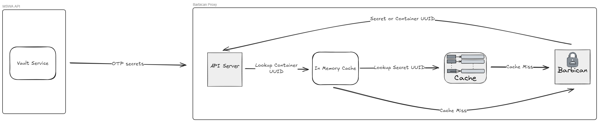

# Barbican Proxy
This repo contains a simple go service for proxying requests to OpenStack's key manager service, [Barbican](https://docs.openstack.org/barbican/latest/).

## Motivation
Barbican unfortunately only allows querying entire secret "containers" (eg buckets) or by UUID. This means that without the UUID of a secret, one would need to query all the secret names and UUIDs, then parse through them. Containers help reduce the search space, but this is still incredibly ineffecient.

## Architecture
### Local Caching
To solve this, we take advantage of 2 caching strategies: local memory, and kv memory. For the MSWA, most likely each user will get their own container, and since all we need to store is a map between the name of the container and its UUID, each container will only occupy 32 bytes of space. For example:
```json
// assuming each uuid is 16 bytes
{
    "user-uuid":"barbican-container-uuid"
}
```
100k users would occupy just under 3.2 mb of memory, making this scalable in the long run. Additional improvements could be made via a specialized load balancing algorithm later on to spread out the number of users across multiple instances.

### Remote Caching
The other half of this is utilizing a KV to map secret names (once again, still uuids) to barbican UUIDs. If a secret misses the cache, we can reload it and search again. The effeciency of this can be later improved upon by doing secret rotation and TTL depending on the field, as well as path searching, or treating each user as its own secret record.

